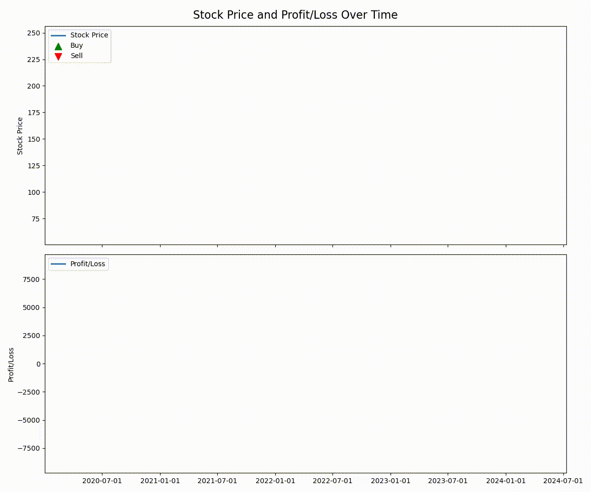

# Algorithmic Trading Strategy Project

## Objective

This project implements an end-to-end machine learning-based algorithmic trading strategy. It uses historical stock data to predict future trends and execute trades based on these predictions and technical indicators.

## Features

- Data retrieval using yfinance
- Feature engineering including SMA, trend decomposition, and other technical indicators
- Machine learning prediction using Random Forest Classifier
- Realistic trading simulation with transaction costs
- Performance visualization and metrics calculation

## How to Use

1. Install dependencies :     pip install -r requirements.txt
2. Run the main script :  python main.py
3. The script will analyze the stock (default is GOOGL), display visualizations, and print performance metrics.

## Data Sources

This project uses Yahoo Finance (yfinance) to retrieve historical stock data.

## Methodology

1. Data Retrieval: Download historical stock data.
2. Feature Engineering: Calculate technical indicators and decompose time series.
3. Machine Learning: Train a Random Forest Classifier using walking forward validation.
4. Trading Simulation: Implement a realistic trading strategy based on ML predictions and technical indicators.
5. Performance Analysis: Calculate and visualize various performance metrics.

## Results

The project generates visualizations for:

- Stock price, SMAs, and trade points
- Machine learning predicted trend
- Buy/Sell signals over time
- Cumulative returns

It also calculates and prints performance metrics including total return, annualized return, Sharpe ratio, and maximum drawdown.

<pre>

<code class="!whitespace-pre hljs language-markdown">
</code>

</pre>

<video width="820" height="640" controls>
  <source src="stock_animation.mp4" type="video/mp4">
  Your browser does not support the video tag.
</video>

## Future Improvements

- Implement additional machine learning models
- Incorporate more data sources
- Optimize hyperparameters
- Implement portfolio management for multiple stocks
